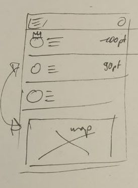

# Ergebnisse Brainstorming 7. Feb 2024

## Screens Lisa

Eine *potentielle Startseite* nach der ersten Anmeldung könnte wiefolgt aufgebaut sein:

Eine Übersichtskarte zentriert auf den eigenen Standort, mit Markern für gesammelte Datenspenden in der Umgebung.

Unterhalb der Karte Buttons mit verschiedenen Aktionsmöglichkeiten.

- Kategorien: Auf der Karte dargestellte Datenspenden nach Kategorien filtern bzw darzustellende Kategorien auswählen

- Neu: Eine neue Datenspende hinzufügen, basierend auf der aktuellen Position

Updates oder eine andere Funktionalität die hier sinnvoll wäre

- Listen: Listenansicht der Datenspenden als Alternative zur Kartenansicht

Die Ansicht zur Bearbeitung einer Datenspende könnte so aussehen:

Die entstehende oder zu bearbeitende Datenspende wird auf ihrer Position innerhalb einer Karte dargetellt.

Abhängig vom Datenmodel (TBD) reicht in dieser Version die Angabe der entsprechenden Kategorie und die Geo-Koordinaten aus, um einen neuen Datensatz zu speichern.

Ein Bestehender Datenstatz kann einen Status verändern. Denkbare Zustände wären "defekt", "repariert", "erweitert" etc. oder ein Freitextfeld.

Ein Datensatz kann auch entfernt werden, wenn er nciht mehr existiert.

Als einfache Interaktion mit bestehenden Datensätzen kann ein Datensatz einfach "verifiziert" werden, oder (wieder abhängig vom Datenmodell) mit weiteren Eigenschaften hinzu gefügt werden. (Anmerkung: in anderen Ansätzen gibt es die Idee der "Vollständigkeitsanzeige", die hier auch einfließen kann)

Im Sinne der Motivations-/ Gamification-Elemente der App, können genau diese Bearbeitungen mit verschiedenen Punkten belegt werden. zB einfache "Verifizierung" 1pt, Hinzufügen einer Eigentschaft 3pt, neu hinzufügen 5pt etc

Ein Leaderboard oder Ranking könnte so aussehen:

Ein Kartenausschnitt mit den Datenspenden der Region/ des Landkreises (basierend auf aktueller Position), evtl unterschieden nach diese Woche neu/verändert und alt/unverändert.

Eine Liste von Useraccounts, die in diesem Landkreis in der letzten Woche Datenspenden und Punkte gesammelt haben.

Es soll nicht möglich sein, von den Datenspenden einer Person auf ihr Bewegungsprofil Rückschlüsse zuziehen.

Leaderboards sollten sich wöchentlich zurücksetzen, damit ein (Wieder-) Einstieg möglich ist. Für Langzeituser könnten zusätzlich Badges für wiederholtes Anführen des Leaderboards vergeben werden.

## Screens Jonas
Meine Idee war das Thema Gamification in den Vordergrund der Anwendung zu stellen. Das Gameplay sollte Aufgaben beinhalten, die man in seiner näheren Umgebung erfüllen kann um so Punkte zu sammeln. Um den Community Gedanken zu stären wäre es auch denkbar, dass man sich in Teams zusammen schließen kann um gemeinsam gegen eine fiktive Bedrohung anzukämpfen. Die Bedrohung kann nur abgewendet werden, wenn Gegenstände/Objekte gefunden, verifiziert oder deren Existenz wiederlegt werden können.

Öffnet man die App, sieht man zunächst Aufgaben die in der näheren Umgebung erfüllt werden können. Eine Aufgabe könnte sein zu bestätigen, dass ein Objekt am vorgesehenen Ort wirklich vorhanden ist.

Denkbar wäre auch die Vollständigkeit eines Datensatzes in einem Fortschrittsindikator anzuzeigen. Mit der Zeit verliert der Datensatz an Glaubwürdigkeit und macht eine neue Verifikation der Community erforderlich. 

Fehlen Aufgaben in der näheren Umgebung kann ein Benutzer auch einen neue Aufgabe (also einen neuen Datensatz) erfassen. Die Aufgabe steht dann anderen Teilnehmern der Community zur Verfügung und muss noch bestätigt werden um sicherzustellen, dass dieser Datensatz wirklich existiert.

So entsteht zu jedem Datensatz eine Historie in dem erkennbar ist, wer zu diesem Datensatz beigetragen hat und wann er zuletzt bestätigt wurde. 

Über die App könnten verschiedene Kategorien von Datensätzen gesammelt werden. Wichtig wäre, dass diese 
- georeferenziert
- ortsfest 
- für Bürger öffentlich zugänglich und 
verifizierbar sind. 
Über die Zeit könnten die Kategorien der Aufgaben erweitert werden.

Mögliche Kategorien könnten sein: 
- Bäume (Baumkataster), Obstbäume (Mundraub)
- Öffentlich zugängliche Fahrradpumpen oder Fahrrad Reparaturstation

Weitere Gedanken: 
- Es wäre schön den Nutzern anzuzeigen, an welchen Projekten er beteiligt war und wo er überall Daten beigetragen hat. 
- Eine der Aufgaben könnte auch Fragen zu den Community Regeln zu beantworten. 
- Es könnte ein Leaderboard angezeigt werden, in dem die aktivsten Mitglieder der Region angezeigt werden.

